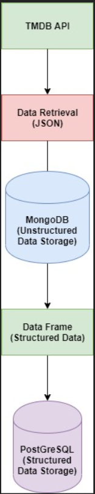
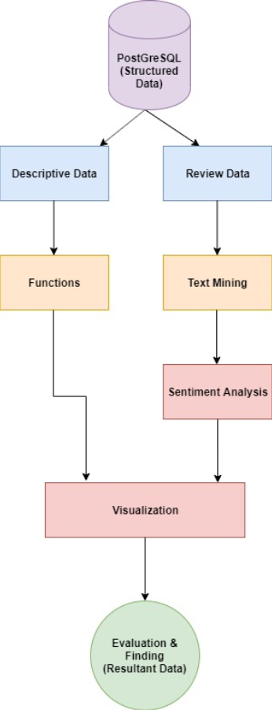

# Visualizing-the-various-trends-among-popular-movies-TV-shows-and-a-sentiment-analysis-of-their-revi

# Masters in Data Analytics Project

## Project: Visualizing the various trends among popular movies, TV shows and a sentiment analysis of their reviews

## Table of Contents

- [Overview](#overview)
- [Methodology](#method)
- [Components](#components)
  - [Movie metadata](#movie_full)
  - [TV Shows metadata](#tv_full)
  - [Movie Reviews](#movie_reviews)
  - [TV Shows Reviews](#tv_reviews)
- [Running the Code](#running)
- [Screenshots](#screenshots)
- [System Configuration steps](#config)
- [File Descriptions](#files)
- [Credits and Acknowledgements](#credits)

***

### Overview
The aim of this research is to analyse the various trends and distributions among popular movies and tv shows along with a sentiment analysis of the reviews for them. Considering the number of movies and tv shows spread throughout the years along with their popularity, ratings, genres and various other intrinsic factors, we have created visualizations for better understanding of what the current trends have been. Along with this, a sentiment analysis of the various reviews were considered which was divided into positive and negative reviews and a visual study was conducted to find comparisons between these two modes of entertainment. A notable finding was that there is no correlation of the ratings and the popularity of movies as well as tv shows along with the fact that movies and tv shows released very recently have more popularity than others. In terms of the sentiment analysis of reviews for these popular movies and tv shows, the most number of popular tv shows is in the Drama genre, but it also has the most number of negative reviews.

### Methodology

Each of the files in this project follows the same methodology in order to extract, transform and visualize the data. Below image shows the same - 

  

### Components
There are four components to this project:

#### Movie Metadata
- Extracts the movie metadata like runtime, genre, production country, production company, etc.
- Transforms the data.
- Creates visualisations.

#### TV Shows Metadata
- Extracts the tv shows metadata like runtime, genre, production country, production company, etc.
- Transforms the data.
- Creates visualisations.

#### Movie Reviews
- Extracts the movie review data.
- Transforms the data.
- Performs sentiment analysis on the reviews.
- Creates visualisations.

#### TV Shows Reviews
- Extracts the tv shows review data.
- Transforms the data.
- Performs sentiment analysis on the reviews.
- Creates visualisations.

### Running the Code

In order to generate the visualizations, the following sequence needs to be followed to run the code. This is due to the fact that the movie and tv show metadata being extracted and fed into the databases is also being used by the visualisations created in the movie and tv show reviews.

- Movie_FULL.py
- TV_FULL.py
- Movie_Review.py
- TV_Review.py

### Screenshots

### System Configuration Steps

In order to run the codes mentioned in this project, you need to follow the below given configuration steps :

1)	TMDB API Key –
For you to execute these codes, you will need to create your own account on TMDB and generate an API Key using which the code can extract the data from the repository.
Link - https://www.themoviedb.org/documentation/api

2)	MongoDB as a NoSQL Database –
As the API of TMDB provides data in JSON Format, you will need to have a NoSQL Database to store this data. In this case, we have used MongoDB as our NoSQL solution. You will also need to create a user and password in MongoDB. Command line that you can use to create the user given in the code is below –
db.createUser( { user: "dapgrpl",
                 pwd: "dapgrpl",
                 roles: [ { role: "root", db: "admin" } ]
} )

3)	PostgresSQL as an RDBMS solution –
Once a dataframe is created in the code, this is stored as a table in an RDBMS. We have chosen PostgresSQL as our RDBMS solution. Here as well, you will need a user to be created in postgresSQL. You can use the below command in postgres to create the user used in the code –
CREATE USER dapgrpl WITH PASSWORD 'dapgrpl' CREATEDB;

4)	Google Chrome Browser –
As the visualizations created open in an html file, you will need a web browser to see and interact with these visualizations. We tried with default windows browsers like Internet Explorer and Edge and the interactions in the html files were misbehaving. Hence, we would urge you to install Chrome browser to see these visualizations without any hiccups.
Note – We haven’t tried with Safari browser and hence cannot infer on how the visuals would behave there.

5)	Python –
As the code is written in python, you will need to download and install the latest version of python along with the below given packages in it using the “pip install” method or any other method you prefer.
Packages :
requests
pymongo
pandas
psycopg2
numpy
plotly
statistics
json
nltk
afinn
scattertext
re 	
io
pprint
scipy
spacy
os
pkgutil
urllib
IPython
sklearn

6)	Spyder or any other Python IDE for executing the code –
It will help to have any kind of Python IDE installed on your machine to have a better look at the code and to execute it easily in the python console.

7)	Final checks –
Please verify and change the IP Address mentioned in the code to the IP Address of the machine on which you have installed MongoDB and PostgresSQL along with the port numbers if you have changed while installing these softwares. Also, if you are creating a user with a different user ID and password, be sure to change the same as well in the code before proceeding with the execution.

### File Descriptions

The code files are kept under the folder 'Codes'. Below is a short description of the files:

- Movie_FULL.py: To extract, transform and create the visualizations for the movie metadata.
- TV_FULL.py: To extract, transform and create the visualizations for the tv shows metadata.
- Movie_Review.py: To extract, transform and create the visualizations for the movie reviews.
- TV_Review.py: To extract, transform and create the visualizations for the tv show reviews.

### Credits and Acknowledgements

* [TMDB](https://www.themoviedb.org/) for providing the data used for this project.
* [NCI](https://www.ncirl.ie/) for a challenging project as part of their full-time masters in data analytics course subject 'Database and Analytics Programming'
